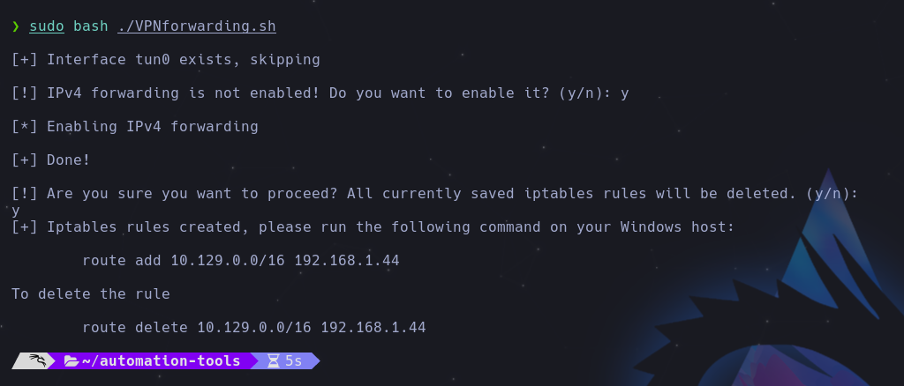

# Automation-tools

This repository contains a collection of automation scripts for penetration testing (pentest) and CTFs mostly written in Python and Bash. These scripts are designed to simplify and streamline various tasks related to security testing, vulnerability assessment, and cybersecurity challenges.

## VPNforwarding.sh 

This Bash script is designed to set up IP forwarding and redirect traffic from the "tun0" interface to a specific Windows host. It is particularly useful when working with HTB (Hack The Box) or other scenarios where you need to redirect traffic without changing your VPN setup.

### Prerequisites

Before using this script, make sure you have the following prerequisites in place:

- **OpenVPN**: Ensure that you have OpenVPN running on your system to create the "tun0" interface.
- **Root Access**: You need to run the script with superuser (root) privileges.

## Usage

1. Run the script in any of the following ways

   ```bash
   chmod +x VPNforwarding.sh 
   sudo ./VPNforwarding.sh
   sudo  bash ./VPNforwarding.sh
   ```



2. Now copy the script output on your Windows VM


3. To delete changes on both hosts just run this commands:

**Linux**

```bash
sudo bash -c "echo 0 > /proc/sys/net/ipv4/ip_forward"; iptables --flush; iptables --table nat --flush; iptables --delete-chain; iptables --table nat --delete-chain
```
**Windows**

```bash
route delete {subnet}/{mask} 192.168.1.44
```
